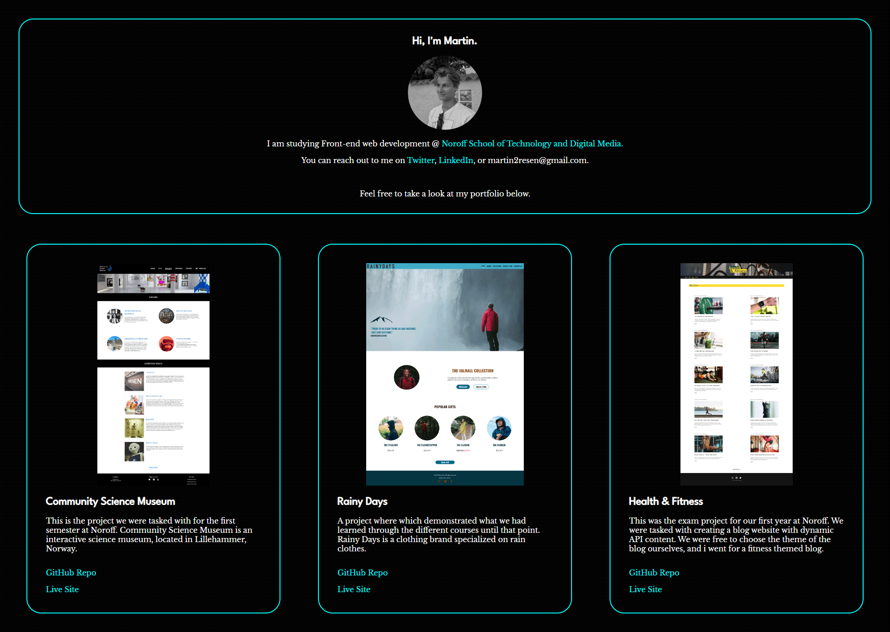

# Portfolio

## Description

This is a portfolio website displaying the three major projects we had at Noroff this academic year.

## Built With

- [HTML](https://developer.mozilla.org/en-US/docs/Web/HTML)
- [CSS](https://developer.mozilla.org/en-US/docs/Web/CSS)

## Getting Started

### Installing

You can install the project by cloning the github repo to your computer.

### Running

You can see a live version of the website by running the VSCode project with the Live Server extension.

## Contact

[My Twitter page](https://twitter.com/martinth0resen)

[My LinkedIn page](https://www.linkedin.com/in/martinthoresen/)

## Acknowledgments

Google Fonts for free, open-source fonts - [Google Fonts](https://fonts.google.com/)

Toptal for great background pattterns for your website - [Subtle Patterns](https://www.toptal.com/designers/subtlepatterns/subtle-carbon/)

<h1 align='center'> Hi! :wave: I'm Martin.</h1>

- Front-End Development @ Noroff

For enquiries, reach out @ martin2resen@gmail.com or <a href="https://twitter.com/martinth0resen">Twitter</a>.

